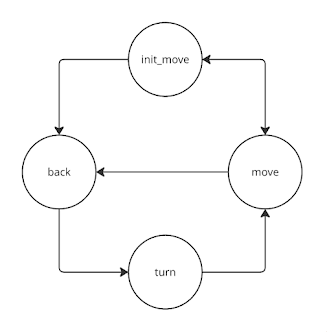

# Basic Vacuum Cleaner

**Skills:** Mobile Robotics, Autonomous Navigation, Finite State Machines, Obstacle Avoidance, Python

## Overview

This project implements a basic autonomous vacuum cleaner capable of cleaning an unknown environment using only bumper sensors. The objective is to maximize area coverage while maintaining a simple and computationally efficient navigation strategy.

## Objective

Design and implement a navigation algorithm for a low-cost autonomous vacuum cleaner using bumper sensors for collision detection and reactive obstacle avoidance.

## Technologies and APIs

- Python
- Frequency API
- Robot API
- WebGUI

## Navigation Strategy

The cleaning behaviour is based on a finite-state machine that alternates between spiral and straight-line movements.

The robot starts by performing expanding spirals for 20 seconds in order to cover as much area as possible around its initial position.

To prevent excessive speed, the robot increases its linear velocity only up to a predefined limit. Once this limit is reached, the linear velocity remains constant while the angular velocity is progressively reduced, increasing the spiral radius and extending the explored area.

After 20 seconds, the robot switches to straight-line motion for 4 seconds before returning to spiral movement. This cycle repeats continuously throughout execution.

Whenever a collision is detected, the robot executes an avoidance manoeuvre consisting of:

1. Moving backwards for a short period.
2. Performing a random rotation.
3. Returning to the cleaning behaviour.

The rotation direction and duration are randomly selected, allowing the robot to explore different regions of the environment.

## State Machine



The controller is composed of four states:

| State | Description |
|---------|-------------|
| `init_move` | Initial spiral movement |
| `move` | Straight-line motion |
| `back` | Reverse movement after collision |
| `turn` | Random rotation |

## Collision Detection

Obstacle detection is performed using the bumper sensor:

```python
Hal.getBumperData().state
```

When the bumper is activated, the robot immediately transitions to the avoidance behaviour.

## Challenges and Solutions

### Motion Parameter Tuning

One of the main challenges was finding suitable velocity and timing parameters. Poorly tuned spirals either revisited the same locations repeatedly or expanded too quickly, leaving unexplored regions.

### Reverse State Timing

The reverse state occasionally showed inconsistent behaviour due to timing interactions between state transitions and loop execution frequency. Increasing the control frequency improved the response in most situations.

### Coverage Efficiency

Initial experiments showed that the robot often remained within a limited area. Increasing the straight-line velocity improved exploration and allowed the robot to reach previously unvisited regions more frequently.

### Spiral Growth Strategy

Simply increasing the linear velocity produced excessive speeds. To address this issue, a maximum linear velocity was introduced. Beyond this limit, the spiral continued to grow by gradually reducing the angular velocity instead.

## Results

The robot successfully performs autonomous cleaning using a simple reactive strategy based on bumper sensing and random obstacle avoidance.

### Demonstration Video

[Watch the demonstration on YouTube](https://www.youtube.com/watch?v=[TU_VIDEO](https://youtu.be/2-ewwnZNa9E))

## Conclusions

This project demonstrates how a simple finite-state machine combined with reactive obstacle avoidance can achieve autonomous cleaning behaviour without requiring complex mapping or localization algorithms.

Although the random turning strategy provides robustness and simplicity, coverage efficiency remains limited because the robot may repeatedly revisit previously cleaned areas. More advanced navigation techniques could significantly improve exploration and cleaning performance.
