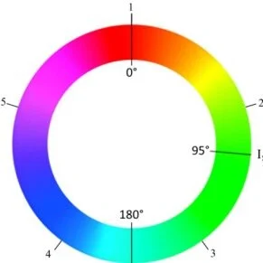

# Follow Line

**Skills:** Computer Vision, PID Control, Autonomous Driving, Image Processing, Python, OpenCV

## Overview

This project implements a reactive line-following controller for an autonomous Formula 1 vehicle. The objective is to detect a red racing line using computer vision techniques and follow it using an adaptive PID controller capable of handling both straight sections and curves.

## Objective

Develop a vision-based controller that enables the vehicle to follow a red line painted on a racing circuit while maintaining stability and achieving competitive lap times.

## Technologies

- Python
- OpenCV
- NumPy
- PID Control
- Camera Sensor

## Method

### Image Processing

The first step consists of processing the camera image to detect the red racing line.

The image is converted from the BGR color space to HSV, since HSV provides more robust color segmentation under varying lighting conditions.

Because red appears at both ends of the hue spectrum, two independent masks are created:

- Lower red hue range
- Upper red hue range

Both masks are combined into a single binary image containing all detected red pixels.

To reduce computational cost, only the lower half of the image is processed because the line is always visible in that region.



### Line Center Detection

Once the red pixels are detected, the algorithm searches for the first row containing red pixels, starting from the center of the image and moving downward.

The next 20 rows are then analyzed to create a region of interest.

Using NumPy, the average x-coordinate of all red pixels is computed, producing the estimated center of the line.

The tracking error is defined as:

```text
error = image_center - line_center
```

This error is used by the controller to steer the vehicle.

### Curve Detection

To determine whether the vehicle is entering a curve, the algorithm compares the horizontal positions of the first and last detected line centers.

Large differences indicate a curved section of the circuit.

When a curve is detected, the controller automatically switches to a different set of PID parameters.

### Adaptive PID Controller

Different controller parameters are used for curves and straight sections.

#### Curves

```python
kp = 0.025
kd = 0.0007
kvel = 0.02
V_MAX = 15
```

#### Straight Sections

```python
kp = 0.003
kd = 0.0002
kvel = 0.015
V_MAX = 20
```

These values provided the best balance between speed and stability across all tested circuits.

The controller consists of:

- PD control for angular velocity.
- P control for linear velocity.

### Linear Velocity

```python
V = V_MAX - kvel * (abs(error) + 0.5 * abs(der))
```

Including the derivative term helps smooth speed transitions and reduces abrupt velocity changes.

### Angular Velocity

```python
w = kp * error + kd * der
```

This PD controller adjusts steering according to the current error and its rate of change.

Velocity limits were applied to ensure stable vehicle behaviour.

### Line Recovery

If the vehicle loses the line:

- At startup, it slowly turns left until the line is detected.
- During the race, it continues turning according to the previous error using reduced control gains until the line reappears.

## Challenges and Solutions

### Color Detection

Different circuits presented different red tones and brightness levels.

For example, the Montreal circuit required readjusting HSV thresholds because the red line appeared darker than in other environments.

### PID Tuning

Using the same PID gains for curves and straight sections produced oscillations and unstable tracking.

This issue was solved by detecting curves and dynamically changing controller parameters.

### Line Position Estimation

Initially, only the lowest detected row was used to compute the line position.

Although this approach produced very fast lap times, the vehicle frequently cut corners and followed the line inaccurately.

The solution was to compute the centroid using multiple line samples, improving robustness and accuracy.

### Single Midpoint Detection

An early approach relied on detecting the line at a fixed image height.

In some curves, no red pixels were present at that location, causing the vehicle to lose the line completely.

Using a centroid-based method solved this issue by considering multiple points simultaneously.

## Results

The vehicle successfully completed all tested circuits while maintaining stable line tracking and competitive lap times.

### Demonstration Videos

#### Simple Circuit

[Blogger Video](https://youtu.be/k-15ee7Rgf0)

#### Fastest Simple Circuit Version

[Blogger Video](https://youtu.be/HVHLOhvLfzE)

#### Montreal Circuit

[Blogger Video](https://youtu.be/B6laYt0O0s4)

#### Montmeló Circuit

[Blogger Video](https://youtu.be/qjQI6gEyWXk)

#### Nürburgring Circuit

[Blogger Video](https://youtu.be/JUV3ZLuaqe4)

## Conclusions

This project demonstrates how computer vision and adaptive PID control can be combined to achieve robust autonomous line following.

The use of HSV color segmentation, centroid-based line detection, and adaptive controller parameters significantly improved tracking performance across different circuits and lighting conditions.

Although the vehicle achieves good lap times, future improvements could include predictive control techniques and more advanced curve anticipation methods.
